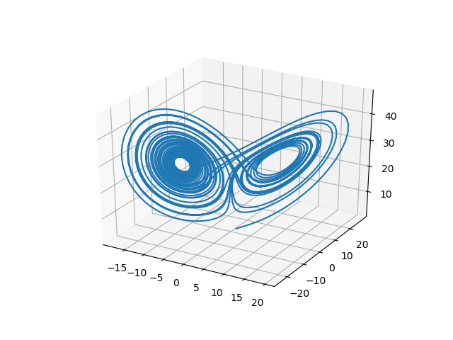

# Chaos Equations

A **chaos equation** is a system of *n* arbitrary equations describing coordinates of a point in *n* dimensional space.
There are 2 formulas chosen in 2D space describing *x* and *y* coordinates, which begin in an arbitrary value. Using **constants** changes the behaviour of the movement.
We apply the formulas to calculate new x, y coordinates repeatedly *n* times to see the outcome of the created *chaos equation*.

* Example:
1. Start at position: *[x,y] = [1,1]*
1. Define a constant: *T = 3*
1. Formula for new x: *new_x = x + y\*T*
1. Formula for new y: *new_y = x - y\*T*
1. Count new *x, y* repeatedly *n* times and observe

* Python Code:
```python
n = 5 # number of iterations
x, y = (1, 1) # initial coordinates
T = 1.5 # arbitrary constant

for i in range(1, n+1): # repeat n times
    new_x = x + y*T # calculate new x
    new_y = x - y*T # calculate new y
    x, y = (new_x, new_y) # set x, y to new_x, new_y respectively
    print(f"{i}. iteration [x, y] = [{x}, {y}]")
```

* Output:
```
1. iteration [x, y] = [2.5, -0.5]
2. iteration [x, y] = [1.75, 3.25]
3. iteration [x, y] = [6.625, -3.125]
4. iteration [x, y] = [1.9375, 11.3125]
5. iteration [x, y] = [18.90625, -15.03125]
```

* We can plot the result with Python [matplotlib](https://matplotlib.org/) library:


* Plotting the same equation with changed T constant to -1 and number of iterations to 10:


* Output:
```
 1. iteration [x, y] = [  0,  2]
 2. iteration [x, y] = [ -2,  2]
 3. iteration [x, y] = [ -4,  0]
 4. iteration [x, y] = [ -4, -4]
 5. iteration [x, y] = [  0, -8]
 6. iteration [x, y] = [  8, -8]
 7. iteration [x, y] = [ 16,  0]
 8. iteration [x, y] = [ 16, 16]
 9. iteration [x, y] = [  0, 32]
10. iteration [x, y] = [-32, 32]
```

Slight changes to the constant value has sometimes distinctive outcome.

## Point movement vs. Equation movement

Not only we can observe the movement of a point in different equations with their different constant values, but also the movement of all calculated points by changing the constants. Manipulating constant values "moves" the whole equation, hence **equation movement**.

In examples below was used the previous equation with 5 iterations. The plot on the left side shows the *point movement* in different *T* constant values. The plot on the right visualizes *equation movement* between those *T* constants, where *i* means the iteration step. 


Minimalizing differences between the constants results to more detailed movements.


## Time chaos equations

A chaos equation, where a constant is represented by "**time**". The initial coordinates start at an arbitrary *time* value (can be negative). The equations are applied repeatedly to calculate new coordinates. Time changes at given *speed* and new point movements are calculated. Commonly we want to visualize the equation movement.

These equations are explained and visualized in the video in the [video](#references) mentioned below.

### Lorenz system

The Lorenz system is a system of ordinary differential equations first studied by Edward Lorenz. It is notable for having chaotic solutions for certain parameter values and initial conditions. In particular, the Lorenz attractor is a set of chaotic solutions of the Lorenz system which, when plotted, resemble a butterfly or figure eight. ([Wikipedia](https://en.wikipedia.org/wiki/Lorenz_system))



The Lorenz system is represented in 3D space with 3 differential equations for *x, y, z*. It uses the values *10, 28, 8/3* for the constants *S, R, B* respectively.
```
dx/dt = S*(y - x)
dy/dt = x*(R - z) - y
dz/dt = x*y - B*z
```

This system can be represented by *Time chaos equation*.

```python
dx = dt * (S*(y - x))
dy = dt * (x*(R - z) - y)
dz = dt * (x*y - B*z)

new_x = x + dx   # new_x = x + dt * (S*(y - x))
new_y = y + dy   # new_y = y + dt * (x*(R - z) - y)
new_z = z + dz   # new_z = z + dt * (x*y - B*z)
```

The visualization of *The Lorenz system* was created in Processing by [CodingTrain](https://github.com/CodingTrain). ([Video link](https://www.youtube.com/watch?v=f0lkz2gSsIk), 
[Source code](https://github.com/CodingTrain/website/blob/master/CodingChallenges/CC_012_LorenzAttractor/Processing/CC_012_LorenzAttractor/CC_012_LorenzAttractor.pde))

## Convergence and divergence

An iterative expression **converges** after *n* iterations towards a particular number. This expression has then a **limit** equal to the number. An expression **diverges** when it does not approach any number. The divergent expression tends to approach positive or negative infinity or may have a unreachable value **infimum or supremum** (minimum or maximum) but does not approach it. For example a sum of alternating *+1* and *-1* does not have a limit but has a *supremum* of 1 and *infimum* of 0.

### Mandelbrot set

The **Mandelbrot set** is the set of complex numbers *c* for which the function *fc(z) = z\*z + c* does not diverge when iterated from *z = 0*, i.e., for which the sequence *fc(0), fc(fc(0))*, etc., remains bounded in absolute value. ([Wikipedia](https://en.wikipedia.org/wiki/Mandelbrot_set))

A complex number  *(a+bi)* represented in 2D space is simply projecting its real component *(a)* onto *x* axis and its imaginary component *(b)* onto *y* axis. Then we can create a chaos equation out of the Mandelbrot formula and observe its atributes.

The equations for new *x, y*, where *C1, C2* are constants representing real and imaginary part of a complex number respectively:
```
new_x = x*x - y*y + C1
new_y = 2*x*y + C2
```

We use formula to square imaginary numbers and divided the result into its real and imaginary component.

```python
n = 100 # number of iterations
x, y = (0, 0) # starting point
ca, cb = (x, y) # ca is real part of c, cb is imaginary part of c
za, zb = (0, 0)
infinity = 4 # specify infinity in finite spectrum

for i in range(n):
    new_za = za*za - zb*zb + ca # calculate new real part of z
    new_zb = 2*za*zb + cb  # calculate new imaginary part of z
    za, zb = (new_za, new_zb)
    if za*za * zb*zb > infinity: # stop if the new values go beyond infinity value
        break
```

For every equation we can create its own **convergent set**.

---

#### References

* Inspired by [CodeParade](https://www.youtube.com/channel/UCrv269YwJzuZL3dH5PCgxUw)'s video [Chaos Equations - Simple Mathematical Art](https://www.youtube.com/watch?v=fDSIRXmnVvk) on YouTube

* Source code to his solution: https://github.com/HackerPoet/Chaos-Equations

* More about **Chaos theory** on [Wikipedia](https://en.wikipedia.org/wiki/Chaos_theory)

* Solution made using [Processing](https://processing.org/)