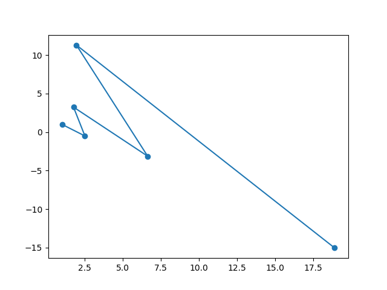
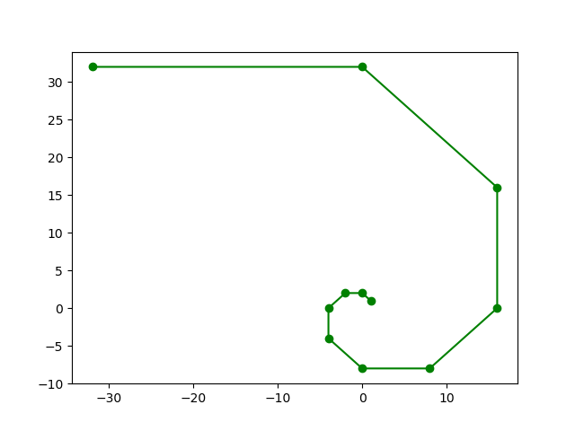
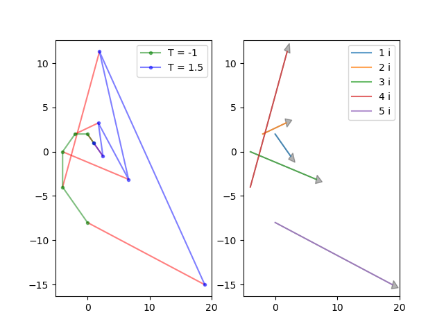
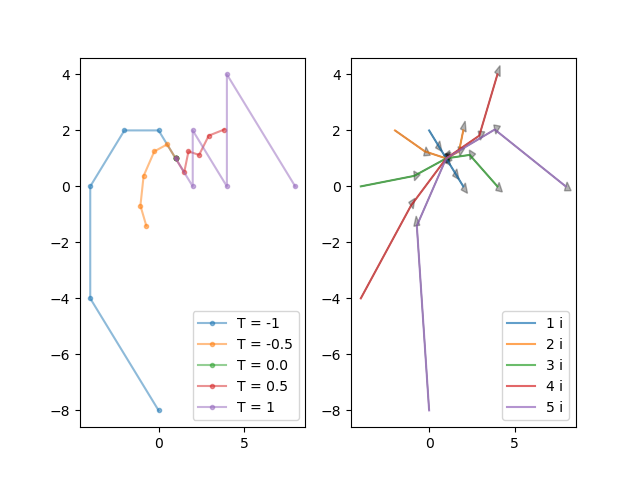

# Chaos Equations

A **chaos equation** is a system of *n* arbitrary equations describing coordinates of a point in *n* dimensional space.
There are 2 formulas chosen in 2D space describing *x* and *y* coordinates, which begin in an arbitrary value. Using **constants** changes the behaviour of the movement.
We apply the formulas to calculate new x, y coordinates repeatedly *n* times to see the outcome of the created *chaos equation*.

* Example:
1. Start at position: `[x,y] = [1,1]`
1. Define a constant: `T = 3`
1. Formula for new x: `new_x = x + y*T`
1. Formula for new y: `new_y = x - y*T`
1. Count new *x, y* repeatedly *n* times and observe

* Python Code:
```python
n = 5 # number of iterations
x, y = (1, 1) # initial coordinates
T = 1.5 # arbitrary constant

for i in range(1, n+1): # repeat n times
    new_x = x + y*T # calculate new x
    new_y = x - y*T # calculate new y
    x, y = (new_x, new_y) # set x, y to new_x, new_y respectively
    print(f"{i}. iteration [x, y] = [{x}, {y}]")
```

* Output:
```
1. iteration [x, y] = [2.5, -0.5]
2. iteration [x, y] = [1.75, 3.25]
3. iteration [x, y] = [6.625, -3.125]
4. iteration [x, y] = [1.9375, 11.3125]
5. iteration [x, y] = [18.90625, -15.03125]
```

* We can plot the result with Python [matplotlib](https://matplotlib.org/) library:


* Plotting the same equation with changed T constant to -1 and number of iterations to 10:


* Output:
```
 1. iteration [x, y] = [  0,  2]
 2. iteration [x, y] = [ -2,  2]
 3. iteration [x, y] = [ -4,  0]
 4. iteration [x, y] = [ -4, -4]
 5. iteration [x, y] = [  0, -8]
 6. iteration [x, y] = [  8, -8]
 7. iteration [x, y] = [ 16,  0]
 8. iteration [x, y] = [ 16, 16]
 9. iteration [x, y] = [  0, 32]
10. iteration [x, y] = [-32, 32]
```

---

### Point movement vs. Equation movement

Not only we can observe the movement of a point in different equations with their different constant values, but also the movement of all calculated points by changing the constants. Manipulating constant values "moves" the whole equation, hence **equation movement**.

In examples below was used the previous equation with 5 iterations. The plot on the left side shows the *point movement* in different *T* constant values. The plot on the right visualizes *equation movement* between those *T* constants, where *i* means the iteration step. 



Minimalizing differences between the constants results to more detailed movements.



---

### Time chaos equations

A chaos equation, where a constant is represented by "**time**". The initial coordinates start at an arbitrary *time* value (can be negative). The equations are applied repeatedly to calculate new coordinates. Time changes at given *speed* and new point movements are calculated. Commonly we want to visualize the equation movement.

---

### Lorenz system

### Mandelbrot set

---

#### References

* Inspired by [CodeParade](https://www.youtube.com/channel/UCrv269YwJzuZL3dH5PCgxUw)'s video [Chaos Equations - Simple Mathematical Art](https://www.youtube.com/watch?v=fDSIRXmnVvk) on YouTube

* Source code to his solution: https://github.com/HackerPoet/Chaos-Equations

* More about **Chaos theory** on [Wikipedia](https://en.wikipedia.org/wiki/Chaos_theory)

* Solution made using [Processing](https://processing.org/)